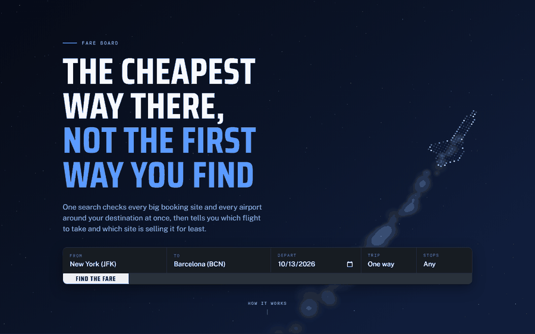

# Fare Board

Ask for any flight, on any date. It launches a browser per search, reads
Google Flights, Kayak, Momondo, Expedia and Priceline at the same time, adds
every airport around your destination, and tells you which flight to take and
which site is selling it for least.

Built on [Solari](https://getsolari.com) cloud browsers, on a fork of their
[cookbook](https://github.com/solari-sdk/solari-cookbook).



Tampa to Barcelona, a route it had never priced: **12 seconds, four sites,
$376**. Nothing in that recording is staged — it clears the route from the
cache first, so what you are watching is a real search happening.

## What it found

The tool exists to answer questions that are tedious by hand, so what matters
is what it measured — including the times it disproved what we expected.

| | |
|---|---|
| **The site you book on is worth $141 on a thin route** | 39% on Tampa–Barcelona. On JFK–London it is $23. The tool is nearly worthless on the corridors everyone benchmarks and worth a lot on the routes nobody checks. |
| **A nearby airport saved $80** | Gatwick under Heathrow. But Google and Kayak *both suggest that swap themselves* — against the best hint any single site gave, cross-site search won by **$12**. That is the honest number. |
| **Where you browse from barely matters** | Kayak quoted the identical fare from all seven countries it answered. Widest spread on any site: $14, with prices forced to USD so this is pricing and not exchange rates. |
| **The "from $175" teasers are real** | 8 of 8 held — 5 to the dollar, 3 *cheaper* than advertised. Our first run said otherwise, and that was our bug, not theirs. |
| **Round trips invert all of it** | The airport is worth $24 and the site $125. |

Three of those are negative results. They are here because a tool that only
reports the findings it hoped for is not measuring anything.

## Run it

```bash
cd flight-price-map
pip install -r requirements.txt
cp .env.example .env                 # paste your slr_live_ key in

python trip.py --live --out live.html
python server.py                     # -> http://localhost:8080
```

Type any two airports and any date. A straight answer takes about twenty
seconds; the nearby airports fill in underneath it over the next minute.

Measured on routes that had never been searched:

```
BOS -> LIS   22s   4/4 sites   11 flights   $299
MIA -> MAD   40s   4/4 sites    9 flights   $329
SAN -> LIS   25s   4/4 sites    9 flights   $320
BOS -> LHR   24s   quick answer, Heathrow only
            110s   widened to all 5 London airports, 43 flights
the same search again    0.03s, from cache
```

There are also committed boards you can open straight from a clone, no key
needed: [`trip.html`](flight-price-map/trip.html) for a traveller,
[`board.html`](flight-price-map/board.html) for whoever ran it,
[`teasers.html`](flight-price-map/teasers.html) for the advertised-price check.

## Why cloud browsers

Each of these was tested rather than assumed:

- **No API exists.** Google Flights, Kayak and Momondo publish nothing. A
  browser is not a shortcut here, it is the only door.
- **The sites fight automation.** Skyscanner walls us; Expedia walls us
  intermittently. Stealth and residential egress are load-bearing, not
  decoration.
- **Asking everything at once is the product.** Thirty searches in 113 seconds
  against about eight minutes one after another.

The honest ceiling is blocking rather than engineering. Four sweeps by one
person was enough to lose Skyscanner for a day, which is why the service caches
hard and throttles per site.

The live search runs locally, on your own key: the page above is a snapshot,
and the recording shows a real search. It is deliberately not on a public URL —
a search is about 1.2 browser-minutes, and a search button open to the internet
spends a metered credit on strangers' behalf. `Dockerfile` and `fly.toml` are
in the repo for anyone who wants to host it anyway, with limits sized for that.

Where this still stops, and what would move it — Skyscanner's PerimeterX,
geolocation at a scale worth trusting, thin routes in volume — is set out in
[the write-up](flight-price-map/README.md#what-we-would-still-want-from-solari).

## What is in here

```
flight-price-map/
  server.py       the live service: any route, on request
  compare.py      the fan-out: sites x airports x countries, in parallel
  sites.py        per-site URL builders and result parsers
  trip.py         the traveller's page       board.py    the operator's board
  verify.py       does the advertised price exist?
  demo.py         records the real thing searching, unstaged
  flowtest.py     drives the page in a browser
  parsertest.py   holds the readers to committed fixtures
```

The **[full write-up](flight-price-map/README.md)** is worth more than this
page: the parser faults it has had and how each was caught, why round trips
were silently wrong for a day, what gets past an anti-bot wall and what does
not, and the measurement behind every number above.

A taste of it — each of these shipped, and none of them raised anything:

- Google answers a one-date search with **round-trip fares** unless you say
  "one way", roughly double, and nothing flags it.
- A round-trip card read as two flights, with the return leg wearing the whole
  trip's price. The *count* was right, which is why it looked fine.
- One flight listed four times because three sites spell `6:20 pm` differently
  and Kayak sells it under two ticketing agents.
- Next-day arrival markers dropped, so a flight landing 6:20 AM *tomorrow*
  read as landing this morning.

## The Solari examples this is built on

The upstream cookbook is still here in [`examples/`](examples) — small,
runnable programs for cloud browsers, sandboxes and desktops. The ones this
project leans on:

| Example | What it shows |
| --- | --- |
| [browser-quickstart-py](examples/browser-quickstart-py) | Launch a browser, open a page, read it |
| [browser-stealth-proxy-ts](examples/browser-stealth-proxy-ts) | Stealth mode + residential proxy egress |
| [browser-session-recording-py](examples/browser-session-recording-py) | Record a session, download the replay |

Two gotchas this project paid for, on top of the ones upstream documents:

- **A proxy string and a `ProxyRequest` are the same call.** When every non-US
  country times out at once it is an outage, not an entitlement — the two look
  identical from the client, so re-test before concluding. Ours came back on
  its own after a day.
- **`captcha=True` and `proxy="smart"` are not magic.** Against a site that has
  decided about you, neither helps: six launch configurations, zero through.
  The lever is a cooldown.

## A note on what this is

Fares are read from each site's own public results page, at the rate a person
might plausibly run them. It answers the question you would have answered by
hand, faster. It sells nothing, takes no commission, and does not touch
anyone's account — the price you see is the price the named site was showing,
and you book there.

- Solari — [docs](https://docs.getsolari.com) ·
  [console](https://console.getsolari.com)
- Upstream cookbook —
  [solari-sdk/solari-cookbook](https://github.com/solari-sdk/solari-cookbook)
