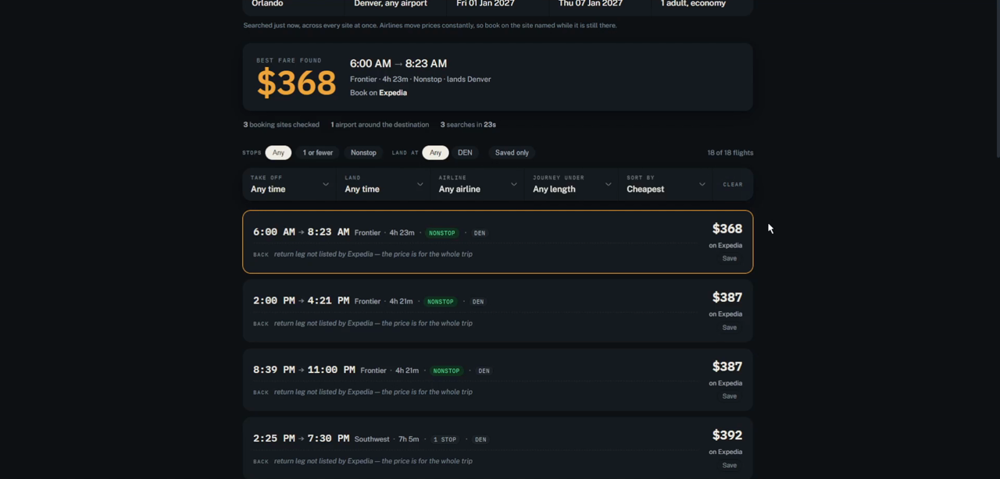

# Fare Board

Ask for any flight, on any date. It launches a browser per search, reads
Google Flights, Kayak, Momondo, Expedia and Priceline at the same time, adds
every airport around your destination, and tells you which flight to take and
which site is selling it for least.

Built on [Solari](https://getsolari.com) cloud browsers, on a fork of their
[cookbook](https://github.com/solari-sdk/solari-cookbook).

**The problem.** Every booking site shows a different price for the same seat,
and none of them tell you the airport an hour up the road is cheaper. Checking
properly is a dozen tabs and twenty minutes, so almost nobody does it — which
means almost nobody knows what that check is actually worth. This measures it.

[](flight-price-map/demo/demo.mp4)

**[▶ Watch the run (1 min)](flight-price-map/demo/demo.mp4)** — Orlando to
Denver and back, MCO–DEN, 1 to 7 January 2027, round trip, stops unrestricted.

It ends on **$368 on Frontier, booked through Expedia**: three booking sites,
one airport, eighteen flights, twenty-three seconds. The outbound is a 4h 23m
nonstop — the search never asked for a nonstop, that was simply the cheapest
thing any site had.

Nothing in the recording is staged, and the parts that went badly are still in
it. Fares appear as each site answers rather than when the slowest one
finishes, which is why the list fills in while you watch. The first search got
**one** site back out of the four it asked, and the page said so — "1 booking
site checked" — before a re-check got three. That matters more than it looks:
a price comparison that quietly drops a site that refused it is not reporting
the cheapest fare, it is reporting the cheapest fare *it managed to read*, and
it never tells you which one it missed.

## What it found

The tool exists to answer questions that are tedious by hand, so what matters
is what it measured — including the times it disproved what we expected.

| | |
|---|---|
| **The site you book on is worth $141 on a thin route** | 39% on Tampa–Barcelona. On JFK–London it is $23. The tool is nearly worthless on the corridors everyone benchmarks and worth a lot on the routes nobody checks. |
| **A nearby airport saved $80** | Gatwick under Heathrow. But Google and Kayak *both suggest that swap themselves* — against the best hint any single site gave, cross-site search won by **$12**. That is the honest number. |
| **Where you browse from barely matters** | Kayak quoted the identical fare from all seven countries it answered. Widest spread on any site: $14, with prices forced to USD so this is pricing and not exchange rates. |
| **The "from $175" teasers are real** | 8 of 8 held — 5 to the dollar, 3 *cheaper* than advertised. Our first run said otherwise, and that was our bug, not theirs. |
| **Round trips invert all of it** | The airport is worth $24 and the site $125. |

Three of those are negative results. They are here because a tool that only
reports the findings it hoped for is not measuring anything.

## Run it

```bash
cd flight-price-map
pip install -r requirements.txt
cp .env.example .env                 # paste your slr_live_ key in

python trip.py --live --out live.html
python server.py                     # -> http://localhost:8080
```

Type any two airports and any date. A straight answer takes about twenty
seconds; the nearby airports fill in underneath it over the next minute.

Measured on routes that had never been searched:

```
BOS -> LIS   22s   4/4 sites   11 flights   $299
MIA -> MAD   40s   4/4 sites    9 flights   $329
SAN -> LIS   25s   4/4 sites    9 flights   $320
BOS -> LHR   24s   quick answer, Heathrow only
            110s   widened to all 5 London airports, 43 flights
the same search again    0.03s, from cache
```

The live search runs locally, on your own key. It is deliberately not on a
public URL: a search is about 1.2 browser-minutes, and a search button open to
the internet spends a metered credit on strangers' behalf — which the recording
above demonstrates for nothing. `Dockerfile` and `fly.toml` are in the repo for
anyone who wants to host it anyway, with limits sized for that.

There are also committed boards you can open straight from a clone, no key
needed: [`trip.html`](flight-price-map/trip.html) for a traveller,
[`board.html`](flight-price-map/board.html) for whoever ran it,
[`teasers.html`](flight-price-map/teasers.html) for the advertised-price check.

## Where Solari is used

Every price on the screen was read by a real Chromium in Solari's cloud. There
is no scraping library here and no HTTP client pretending to be a browser —
five of these six sites publish no API at all, so a browser is not a shortcut,
it is the only door.

In the recording above, "3 searches in 23s" is three cloud browsers launched at
once, one per booking site, each loading that site's own results page and
having its fares read off it. That is the whole engine. A search that also
widens to the airports around your destination is the same thing multiplied:
six sites times five airports is thirty browsers, which is a hundred and
thirteen seconds instead of the eight minutes it would take one at a time.

| Where | The call | Why it has to be a cloud browser |
|---|---|---|
| **Every fare read** | `launch(stealth=True, proxy=...)`, then ordinary Playwright | No API exists. Without stealth there is no project — Expedia and Skyscanner wall us even with it. |
| **Reading as a local** | `proxy=ProxyRequest(country=…, tier="residential")` | The only way to ask whether a fare is different in Tokyo than in Ohio. |
| **Proving where we stood** | `browser.proxy` → country, tier, timezone | Turns *"we searched from Japan"* from a claim into a fact the board can print. |
| **Thirty searches at once** | many `launch()` calls in parallel | 113 seconds instead of eight minutes. This one is the product, not an optimisation. |
| **Getting through walls** | `captcha`, `web_bot_auth`, `proxy="smart"`, all three tiers | Tested side by side in `bypass.py`, and reported even where the answer was no. |

Deliberately **not** used: sandboxes, desktops, session recording, profiles.
This is a read-the-page problem, not a run-code or drive-a-GUI one, and reaching
for them to touch more of the SDK would be padding.

The honest ceiling is blocking rather than engineering. Four sweeps by one
person was enough to lose Skyscanner for a day, which is why the service caches
hard and throttles per site.

## Why it browses from the US only

To be clear about what is limited: Fare Board happily prices international
*routes* — most of the findings on this page are Tampa to Barcelona and New
York to London, and the live sweep prices eight routes across six continents.
What is US-only is where it stands while it looks. Every search egresses from a US residential IP, so
every price is the price a person in the US is shown.

That is a real limit, because the same seat is not always the same price to a
buyer in São Paulo. We ship it that way not because the rest of the world fails
to connect — all thirteen country and tier combinations we tried came up in two
to four seconds — but because of what happened when they were actually used.
The country sweep ran 24 searches, three from each of eight countries. All
three US searches came back. **Four of the twenty-one non-US ones did not:**
two died with `ERR_TUNNEL_CONNECTION_FAILED` from Germany and Japan, and two
loaded a page with no fares on it.

Twenty-four searches is not a reliability study, and we are not claiming it is
one — that is rather the point of item 2 below. But the direction is the wrong
way, and this particular tool is unusually sensitive to it: a price comparison
that quietly loses some of its searches does not report the cheapest fare, it
reports the cheapest fare *it managed to read*, and it never tells you which
one it missed. Better to say "US only" than to be confidently wrong in a
direction nobody can see.

So the international version is waiting on Solari, in three specific ways:

1. **Non-US egress as steady as US under parallel load.** This is the whole
   blocker. Twenty browsers going at once is the normal case here, not a stress
   test.
2. **Egress budget across many countries and many routes.** Our finding that
   *where you browse barely moves the price* is real but thin: one route, one
   day, seven countries. Confirming or killing it means hundreds of routes,
   which is thousands of browsers.
3. **Skyscanner.** It runs PerimeterX, and six launch configurations got
   through none of the time on both US and GB egress. Outside the US it is one
   of the sites people actually book on, so an international build without it
   is missing a wall, not a nice-to-have.

Currency is ours to fix, not Solari's: prices are forced to USD today so that a
comparison is a comparison, and a real international build would show local
currency with the conversion made explicit.

### What geolocation unlocks

This is the part we most want to build, and the part Solari is uniquely able to
make possible.

Booking sites quote by where you appear to be. Nobody can check that by hand —
you cannot be in São Paulo and Frankfurt in the same second, and a VPN gives you
one country at a time with a data-centre IP the sites already distrust. A
residential exit per browser, thirty at once, is the only practical way to ask
the question properly: **the same flight, on the same date, priced from twenty
countries in the same moment.**

We built the machinery and pointed it at one route. The answer was that it
barely mattered — $14 was the widest spread on any site, currencies forced to
USD so it is pricing and not exchange rates. That is a real finding and we have
published it as one, but it is one route, one day, three searches per country,
with four of the twenty-one non-US searches lost. It settles nothing.

The version worth building runs that sweep across hundreds of routes and can
say *which* routes carry a gap, how large, in which direction, and whether it
tracks the buyer's currency, the airline's home market, or nothing at all. That
is a genuinely unanswered question about how airline pricing works, and it is
answerable with about a thousand browsers and nothing else.

What stands between here and there is non-US egress holding up under parallel
load. The Solari team is moving on it quickly, and it is the only piece missing
— everything else, the fan-out, the dedupe, the reading, already works.


The rest of the list — Priceline's missing itinerary detail, Kiwi's place
slugs, thin routes at volume — is in
[the write-up](flight-price-map/README.md#what-we-would-still-want-from-solari).

## What is in here

```
flight-price-map/
  server.py       the live service: any route, on request
  compare.py      the fan-out: sites x airports x countries, in parallel
  sites.py        per-site URL builders and result parsers
  trip.py         the traveller's page       board.py    the operator's board
  verify.py       does the advertised price exist?
  demo.py         records the real thing searching, unstaged
  flowtest.py     drives the page in a browser
  parsertest.py   holds the readers to committed fixtures
```

The **[full write-up](flight-price-map/README.md)** is worth more than this
page: the parser faults it has had and how each was caught, why round trips
were silently wrong for a day, what gets past an anti-bot wall and what does
not, and the measurement behind every number above.

A taste of it — each of these shipped, and none of them raised anything:

- Google answers a one-date search with **round-trip fares** unless you say
  "one way", roughly double, and nothing flags it.
- A round-trip card read as two flights, with the return leg wearing the whole
  trip's price. The *count* was right, which is why it looked fine.
- One flight listed four times because three sites spell `6:20 pm` differently
  and Kayak sells it under two ticketing agents.
- Next-day arrival markers dropped, so a flight landing 6:20 AM *tomorrow*
  read as landing this morning.

## The Solari examples this is built on

The upstream cookbook is still here in [`examples/`](examples) — small,
runnable programs for cloud browsers, sandboxes and desktops. The ones this
project leans on:

| Example | What it shows |
| --- | --- |
| [browser-quickstart-py](examples/browser-quickstart-py) | Launch a browser, open a page, read it |
| [browser-stealth-proxy-ts](examples/browser-stealth-proxy-ts) | Stealth mode + residential proxy egress |
| [browser-session-recording-py](examples/browser-session-recording-py) | Record a session, download the replay |

Two gotchas this project paid for, on top of the ones upstream documents:

- **A proxy string and a `ProxyRequest` are the same call.** When every non-US
  country times out at once it is an outage, not an entitlement — the two look
  identical from the client, so re-test before concluding. Ours came back on
  its own after a day.
- **`captcha=True` and `proxy="smart"` are not magic.** Against a site that has
  decided about you, neither helps: six launch configurations, zero through.
  The lever is a cooldown.

## A note on what this is

Fares are read from each site's own public results page, at the rate a person
might plausibly run them. It answers the question you would have answered by
hand, faster. It sells nothing, takes no commission, and does not touch
anyone's account — the price you see is the price the named site was showing,
and you book there.

- Solari — [docs](https://docs.getsolari.com) ·
  [console](https://console.getsolari.com)
- Upstream cookbook —
  [solari-sdk/solari-cookbook](https://github.com/solari-sdk/solari-cookbook)
