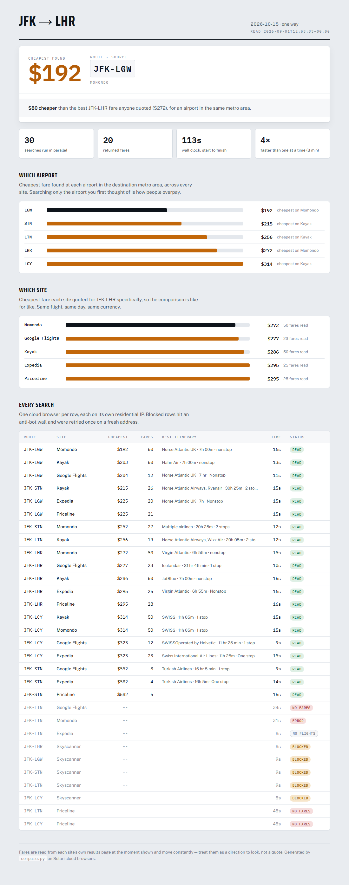

# Fare board

Prices one trip across every major travel site **and every nearby airport at the
same time**, using Solari's cloud browsers and residential proxy egress, then
renders the answer as a departure board.



The point is the parallelism. Checking six sites across five airports is thirty
searches; done one at a time that is about eight minutes of sitting there
watching spinners, which is why nobody does it. Thirty browsers at once returns
in under two minutes, so the thorough answer costs about what the lazy one does.

## What it found

Real run, JFK to London, one way, six weeks out, all prices in USD:

```
best  $192  Momondo  JFK-LGW        30 searches, 20 read, 113s wall clock

cheapest by airport (all sites)       cheapest by site (JFK-LHR only)
  LGW  $192  Momondo  <- cheapest       Momondo    $272  <- cheapest
  STN  $215  Kayak      +$23            Google     $277    +$5
  LTN  $256  Kayak      +$64            Kayak      $286    +$14
  LHR  $272  Momondo    +$80            Expedia    $295    +$23
  LCY  $314  Kayak     +$122            Priceline  $295    +$23
```

Two findings, and the first is much larger than the second:

- **Flying into Gatwick instead of Heathrow saved $80** — the same trip, an
  airport 25 miles away, and invisible to anyone who searched only the airport
  they had in mind.
- **The site you search matters by about $23** on an identical route. Momondo
  and Kayak share a search engine and still quote differently.

Fares move constantly, so treat any specific number as a direction to look
rather than a quote. The gaps are the durable part.

## Run it

```bash
pip install -r requirements.txt
cp .env.example .env          # paste your slr_live_ key into it

python compare.py --from JFK --to LHR --date 2026-10-15 --nearby to
python dashboard.py           # -> dashboard.html
```

Useful flags:

```
--nearby to|from|both   expand a metro area into its airports (see airports.py)
--sites google kayak    restrict to particular sites
--countries us gb de    proxy egress per search (see "Countries", below)
--concurrency 15        browsers at once; the Starter plan allows 20
--per-site 2            simultaneous searches against any single site
--return 2026-10-22     round trip instead of one way
```

## How it holds up against sites that do not want to be read

Four things matter, and each was learned by watching it fail.

**Parse the text, not the DOM.** Every one of these sites obfuscates and rotates
its class names. The words a human reads do not move. Better still, Expedia and
Skyscanner ship screen-reader summary lines — `Select Aer Lingus flight,
departing at 9:05pm, ... priced at $301` — which carry the whole itinerary on
one line and change far less often than the markup around them.

**Wait for results, do not sleep a guess.** These pages poll for fares after
load. A fixed sleep is wrong twice over: too short and Google is still showing
"Loading results", too long and every fast site pays for the slowest one.
`read_when_ready` re-reads until fares appear, then waits a short grace period
and reads again so a page still streaming rows in does not get cut off.
Switching to it took Kayak from 44s to 17s *and* fixed failures.

**Throttle per site, not just overall.** Firing all five airports at one site
simultaneously is what gets you walled — five identical searches landing
together looks like nothing a person does. `--per-site 2` plus a little arrival
jitter fixed Expedia and Kayak, which had been failing intermittently and now
read every route.

It did **not** rescue Skyscanner, and that is worth being precise about.
Skyscanner served three of five routes on the first sweep of the day, then
walled every request for the rest of it — including after throttling was added.
What it is reacting to is the repeated sweeps, not the concurrency within any
one of them. The lever that would help there is a cooldown between runs, not
more tuning; we left it walled rather than escalate, and the board reports it
as blocked.

**Tell the failure modes apart.** "Blocked", "the site says there are no
flights", and "our parser found nothing" need different responses, and lumping
them together hides real bugs. A block gets one retry on a fresh residential IP
after a pause. An honest empty result — Luton genuinely has no transatlantic
service — is not a failure at all and must not be reported as one. Only the
third is our problem to fix.

Blocked rows still show on the board as blocked. A tool that quietly dropped
them would overstate how much of the market it had actually checked.

## Countries

The original idea was to price one flight from many countries at once, since
fares vary by where you appear to browse. That still works in the code —
`--countries us gb de jp` — but **only `us` egress currently connects** on this
plan. Every other country times out at ~32s on a plain `api.ipify.org` load,
which proves it is the proxy and not the target site:

```
  us OK   3s
  ca gb de fr nl es it au jp sg in br mx   all FAIL ~32s
```

Run `python proxycheck.py` to re-test. If your plan includes non-US egress, the
country dimension needs no code changes — pass `--countries` and the dashboard
picks it up.

## Files

```
compare.py     the fan-out: sites x airports x countries, in parallel
sites.py       per-site URL builders and result parsers
airports.py    metro-area airport groups (LON -> LHR LGW STN LTN LCY)
common.py      shared types, money parsing, block and empty-page detection
dashboard.py   results.json -> dashboard.html
parse.py       the Google Flights reader
capture.py     dev tool: dump each site's page text, for writing parsers
preview.py     dev tool: screenshot the dashboard in both themes
proxycheck.py  which proxy countries actually connect
probe.py       first-contact script: does stealth + proxy work at all
```

`pages/` holds captured page text — every failure is written there
automatically, which is the first place to look when a parser stops finding
fares.

## Site status

| Site | Reads | Notes |
|---|---|---|
| Google Flights | yes | needs `one way` in the query or it quotes round trips |
| Kayak | yes | full itinerary detail |
| Momondo | yes | same engine as Kayak, still quotes differently |
| Expedia | yes | screen-reader lines; walls the most aggressively |
| Skyscanner | sometimes | reads on a cold start, then walls repeated sweeps |
| Priceline | prices only | fares read, itinerary detail not parsed yet |
| Kiwi | no | URL scheme needs place slugs, not IATA codes |

## A note on what this is for

Fares are read from each site's own public results page, one search at a time,
at the rate a person might plausibly run them. It answers the question you would
have answered by hand, faster. It is not a booking system and does not touch
anyone's account.
