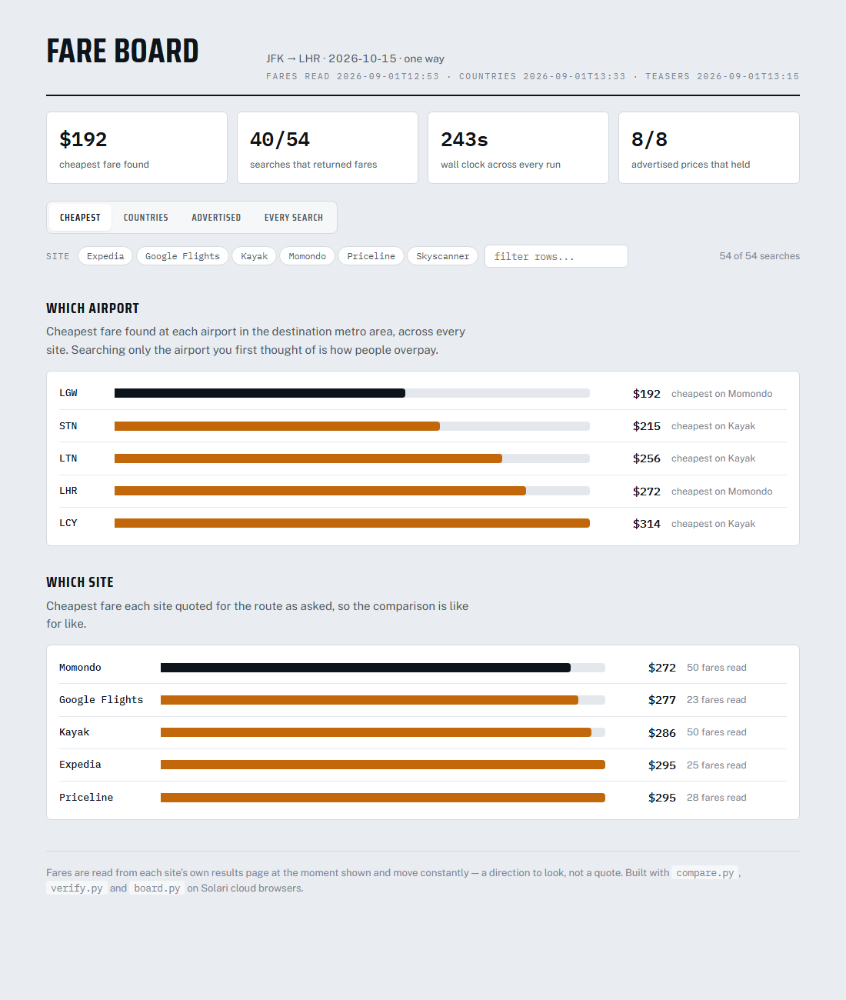
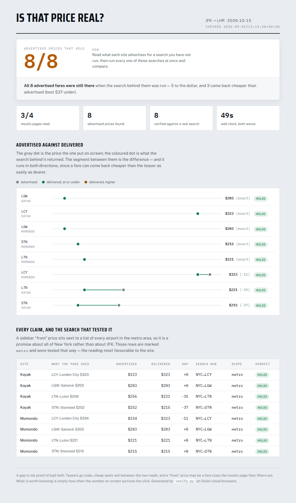
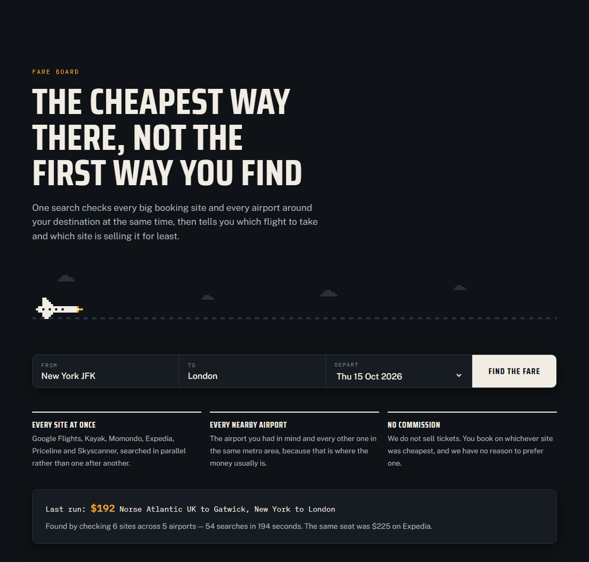
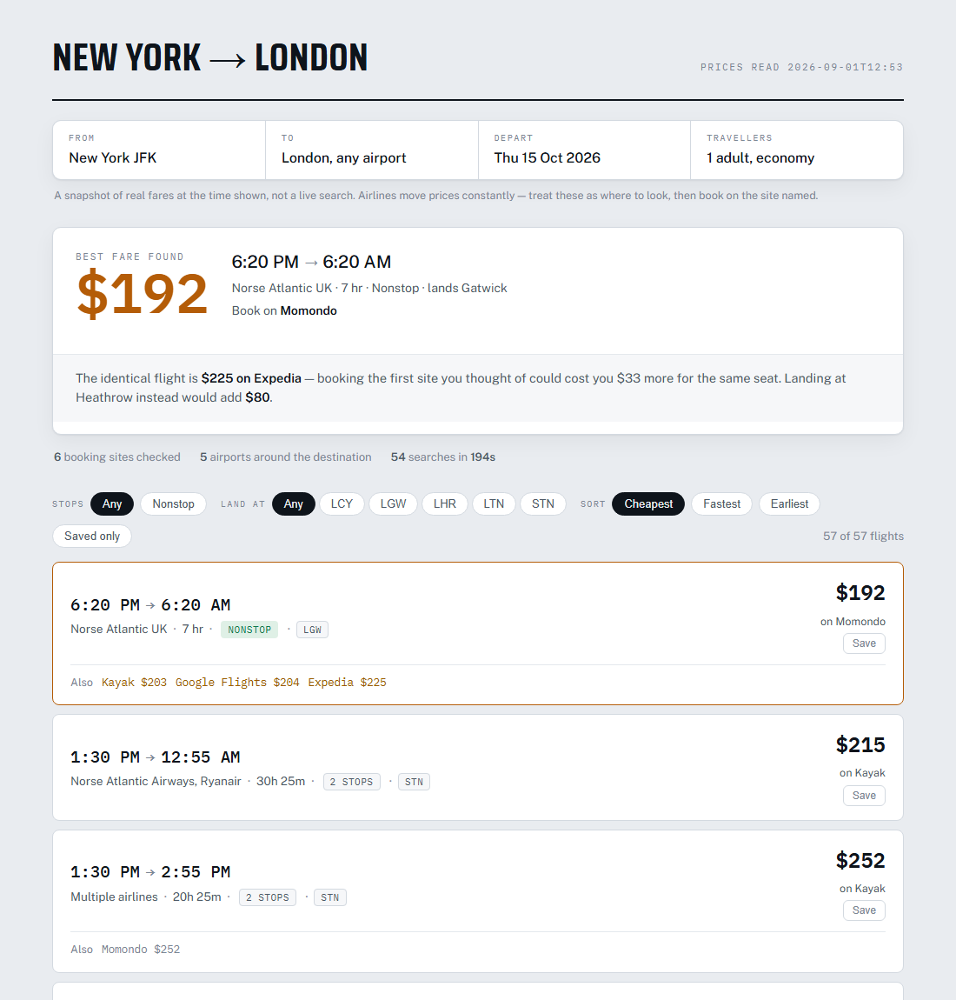
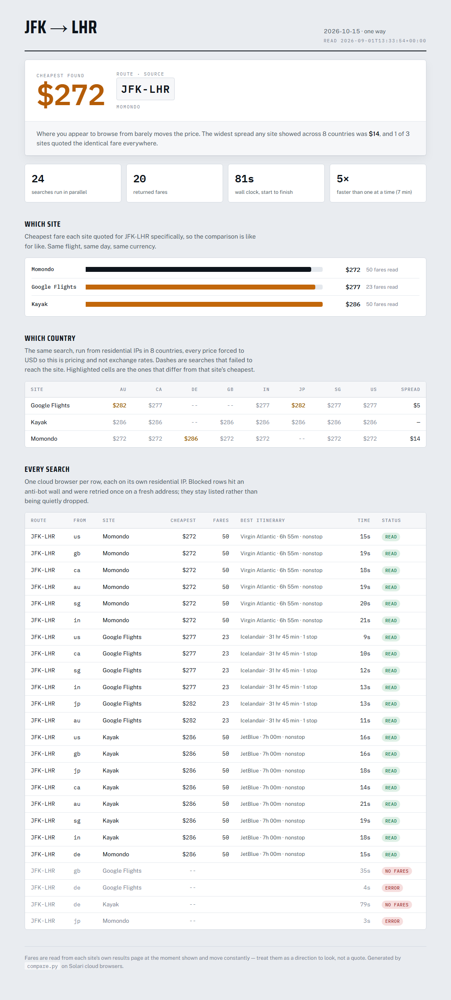

# Fare board

Prices one trip across every major travel site **and every nearby airport at the
same time**, using Solari's cloud browsers and residential proxy egress, then
renders the answer as a departure board.



`board.py` builds one dashboard over every run — cheapest fares, the
country sweep and the advertised-price check — with the data embedded and
rendered in the browser, so filtering by site, searching and sorting the
log are instant and need no server.

The point is the parallelism. Checking six sites across five airports is thirty
searches; done one at a time that is about eight minutes of sitting there
watching spinners, which is why nobody does it. Thirty browsers at once returns
in under two minutes, so the thorough answer costs about what the lazy one does.

## What it found

Real run, JFK to London, one way, six weeks out, all prices in USD:

```
best  $192  Momondo  JFK-LGW        30 searches, 20 read, 113s wall clock

cheapest by airport (all sites)       cheapest by site (JFK-LHR only)
  LGW  $192  Momondo  <- cheapest       Momondo    $272  <- cheapest
  STN  $215  Kayak      +$23            Google     $277    +$5
  LTN  $256  Kayak      +$64            Kayak      $286    +$14
  LHR  $272  Momondo    +$80            Expedia    $295    +$23
  LCY  $314  Kayak     +$122            Priceline  $295    +$23
```

**The honest number here is $12, not $80.** Gatwick came in $80 under
Heathrow, but you do not need this tool to learn that: Google's own results
page said *"Fly to LGW for $204"* and Kayak's said *"Fly nonstop to LGW and
save $111."* Checking nearby airports is a feature both leaders already ship.

What no single site did was find the $192. The cheaper airport and the cheaper
site were two different discoveries, and each site only makes the first one —
about its own inventory. Beating the best hint any one site gave was worth
**$12**. That is a smaller claim and it survives someone opening Google Flights
to check.

The second finding stands on its own: **the site you search is worth about $23**
on an identical route. Momondo and Kayak share a search engine and still quote
differently.

Fares move constantly, so treat any specific number as a direction to look
rather than a quote. The gaps are the durable part.

## Is the advertised price real?

Results pages are full of prices for searches you have not run — a cheaper
airport in a banner, a strip of nearby dates, a "from" price per airline. Each
is a promise, and no comparison site will tell you whether its own promises
hold. `verify.py` runs two waves of browsers: one to collect every advertised
price, then one to run all of those searches at once and see what comes back.

We expected to catch teaser prices that evaporate on click. **They did not.**



```
8/8 advertised prices held.  5 exact to the dollar, 3 cheaper than advertised.

  Kayak    STN: Stansted $252   ->  $215   -37   holds
  Kayak    LTN: Luton    $256   ->  $221   -35   holds
  Momondo  LCY: London City $334 -> $323   -11   holds
  Momondo  LGW: Gatwick  $203   ->  $203    +0   holds
  ...
```

**The first version of this test said otherwise, and it was our bug.** It
reported Momondo advertising $175 and delivering $192 — a broken promise. But
that sidebar price sits beside a list containing JFK, EWR *and* LGA, so it is a
promise about all of New York, not about JFK. Holding it to a JFK-only search
manufactured a gap that was never there. Testing metro-wide claims against a
metro-wide search — the reading most favourable to the site — the gap vanished.

The negative result is worth more than the finding we went looking for: it says
these sites' teaser prices are honest, and it says the methodology is careful
enough to have caught itself being unfair.

Skyscanner is the gap. It carries the richest claims — a seven-day price strip,
each day a testable promise — and it walls us, so those six claims go
uncollected.

```bash
python verify.py --from JFK --to LHR --date 2026-10-15
python teaserboard.py         # -> teasers.html
```

## Holes closed on the way

An audit turned up four things nothing was watching:

- **`+1` was being thrown away.** Kayak marks a next-day arrival on 41 of 50
  fares and we stored none of them, so a flight landing 6:20 AM *tomorrow*
  read as landing this morning. Kept now, and shown on the card.
- **`board.py --roundtrip` was a dead argument** -- declared, never read, so
  the board silently left round trips out while looking complete.
- **Nothing tested the readers.** Every parser fault here has been silent, and
  `flowtest.py` only covers the UI. `parsertest.py` now holds them to committed
  fixtures, one check per bug that actually shipped.
- **Run files were listed by hand**, so a newly priced date was silently
  omitted from the page -- which looks complete and is not. They are discovered
  from disk now.

Still open and worth knowing: nothing guards against a run coming back in a
currency other than USD once non-US egress is in play. `compare.py` warns, the
pages do not.

## Round trips

Round trips were not merely untested; they were **silently wrong**. The Kayak
and Momondo reader anchored on time ranges, and a round-trip card has two of
them. It emitted fifty results from fifty cards, so the count looked right --
but each one described the *return* leg while carrying the whole trip's price:

```
what it reported:   $747  SWISS     8:45 am - 4:35 pm
what the trip is:   $747  out JetBlue 8:45 am - 8:45 pm
                          back SWISS  8:45 am - 4:35 pm
```

Wrong airline, wrong departure time, right price, and nothing to flag it. The
reader now parses whole cards: one fare with two legs, and one-way results fall
out of the same code with a single leg.

Measured on JFK to London, out 15 Oct, back 22 Oct:

```
best  $598  Momondo  JFK-LGW      17/25 searches, 168s

cheapest by site (JFK-LHR)
  Google     $622  <- cheapest
  Expedia    $669    +$47
  Kayak      $747   +$125
  Momondo    $747   +$125
```

**Round trips invert the one-way finding.** One way, the airport was worth $80
and the site $23. Return, the airport is worth $24 and the site **$125**. The
same tool answers "check other airports" for a one-way and "check other sites"
for a return, which is not a conclusion we would have reached by reasoning
about it.

Treat the $125 with some suspicion: Kayak and Momondo sort by price ascending,
so $747 really is the cheapest they offered, but a gap that size against Google
more likely means a fare class one of them is filtering than a real arbitrage.
Worth a look before it goes in a post.

## The traveller's site

`board.py` is for whoever runs the tool. `trip.py` is for whoever takes the
trip: a landing page that asks where you are going, and a result that says
which flight to take and which site is selling it cheapest.



Submitting the form routes to `#/jfk-lon-2026-10-15`, so a result is a link you
can send someone. A route we have not priced says so plainly and offers the
ones we have — the list is short and honest rather than long and invented.



The point it makes is sharper than any of the boards:

```
$192  6:20 PM -> 6:20 AM  Norse Atlantic UK  7 hr  nonstop  Gatwick
      Momondo $192 · Kayak $203 · Google $204 · Expedia $225
```

**One flight, one seat, four prices.** Booking the first site you thought of
costs $33 more than the cheapest, and landing at Heathrow instead adds $80.

Two things had to be fixed before that row was honest. Sites print the same
departure as `6:20 pm`, `6:20 PM` and `6:20pm`, so keying on the printed string
showed one flight four separate times. And Kayak sells that Norse departure
under `Hahn Air` and `A.P.G.` — ticketing agents, not airlines — which split it
again. Flights are keyed on airport, departure minute, duration and stop count,
and labelled with the carrier name most sites agree on.

```bash
python trip.py                          # -> trip.html
python trip.py --board-url <url>        # cross-link to the operator's board

python trip.py --standalone --out preview.html
python flowtest.py                      # drive the whole flow in a browser
```

`flowtest.py` walks the journey a person actually takes — types a route,
reads the answer, reveals all 57 flights, filters to nonstop, sorts, saves a
flight and reloads to check it survived, follows a deep link, and asks for a
route we have not priced. Its expected counts are derived from the run data
rather than hard-coded, so it keeps telling the truth when the data changes.

## Run it

```bash
pip install -r requirements.txt
cp .env.example .env          # paste your slr_live_ key into it

python compare.py --from JFK --to LHR --date 2026-10-15 --nearby to
python board.py               # -> board.html, the dashboard over everything

# same flight, priced from eight countries
python compare.py --from JFK --to LHR --date 2026-10-15     --sites google kayak momondo --countries us gb de jp ca au sg in
python dashboard.py --in countries.json --out countries.html     --title "Country Check"
```

Useful flags:

```
--nearby to|from|both   expand a metro area into its airports (see airports.py)
--sites google kayak    restrict to particular sites
--countries us gb de    proxy egress per search (see "Countries", below)
--concurrency 15        browsers at once; the Starter plan allows 20
--per-site 2            simultaneous searches against any single site
--return 2026-10-22     round trip instead of one way
```

## How it holds up against sites that do not want to be read

Four things matter, and each was learned by watching it fail.

**Parse the text, not the DOM.** Every one of these sites obfuscates and rotates
its class names. The words a human reads do not move. Better still, Expedia and
Skyscanner ship screen-reader summary lines — `Select Aer Lingus flight,
departing at 9:05pm, ... priced at $301` — which carry the whole itinerary on
one line and change far less often than the markup around them.

**Wait for results, do not sleep a guess.** These pages poll for fares after
load. A fixed sleep is wrong twice over: too short and Google is still showing
"Loading results", too long and every fast site pays for the slowest one.
`read_when_ready` re-reads until fares appear, then waits a short grace period
and reads again so a page still streaming rows in does not get cut off.
Switching to it took Kayak from 44s to 17s *and* fixed failures.

**Throttle per site, not just overall.** Firing all five airports at one site
simultaneously is what gets you walled — five identical searches landing
together looks like nothing a person does. `--per-site 2` plus a little arrival
jitter fixed Expedia and Kayak, which had been failing intermittently and now
read every route.

It did **not** rescue Skyscanner, and that is worth being precise about.
Skyscanner served three of five routes on the first sweep of the day, then
walled every request for the rest of it — including after throttling was added.
What it is reacting to is the repeated sweeps, not the concurrency within any
one of them. The lever that would help there is a cooldown between runs, not
more tuning; we left it walled rather than escalate, and the board reports it
as blocked.

**Tell the failure modes apart.** "Blocked", "the site says there are no
flights", and "our parser found nothing" need different responses, and lumping
them together hides real bugs. A block gets one retry on a fresh residential IP
after a pause. An honest empty result — Luton genuinely has no transatlantic
service — is not a failure at all and must not be reported as one. Only the
third is our problem to fix.

Blocked rows still show on the board as blocked. A tool that quietly dropped
them would overstate how much of the market it had actually checked.

## Does the price change by country?

This was the original idea: fares vary by where you appear to be browsing, so
price one flight from everywhere at once. Residential egress in eight countries,
every price forced to USD so the comparison is *pricing* and not exchange rates.

```
same flight, priced from 8 countries (all forced to USD)
  google            $5   au$282 ca$277 in$277 jp$282 sg$277 us$277
  kayak   no difference   au$286 ca$286 gb$286 in$286 jp$286 sg$286 us$286
  momondo          $14   au$272 ca$272 de$286 gb$272 in$272 sg$272 us$272
```



**It barely matters.** Kayak quoted the identical fare from all seven countries
it answered. Google varied by $5 and Momondo by $14, and Momondo's was one
country (Germany) against six that agreed. On this route, the folk wisdom about
VPNing somewhere cheap to buy flights does not survive a controlled test.

Worth being clear about the limits: one route, one date, six weeks out, economy
one-way, on the most competitive air corridor in the world. Thin routes are
exactly where you would expect geographic pricing to show up, and we have not
tested those yet.

### A note on the egress itself

For most of a day, every non-US proxy country failed to connect — 13 countries
timing out at ~32s on a plain `api.ipify.org` load, while `us` answered in 3s.
It looked exactly like a plan entitlement. **It was a transient outage.** The
same calls now succeed in 2-4s, on the same plan, and every tier works:

```
13/13 usable
  smart  us/{residential,static,mobile}  gb/{...}  de/{...}  jp/{...}
```

`proxy="gb"` as a bare string and `ProxyRequest(country="gb")` behave
identically, so it was not an API-shape mistake either. The lesson is only that
a proxy outage and a missing entitlement are indistinguishable from the client
side, and `python proxycheck.py` re-tests both in under a minute.

Non-US egress is a little less reliable than US even when working: 4 of 24
searches in the country sweep died with `ERR_TUNNEL_CONNECTION_FAILED` or an
unfinished page, against none from `us`.

## What gets past an anti-bot wall

Skyscanner blocks us, and the browser SDK has three switches that sound like
the answer: `captcha=True`, `proxy="smart"` (Solari picks the egress and
rotates it on a block), and `web_bot_auth=True`. `bypass.py` tries them side by
side, because a wall looks identical whichever option would have cleared it.

```
stealth + us                 blocked   Are you a person or a robot?
stealth + captcha + us       blocked   Are you a person or a robot?
stealth + smart              blocked   Are you a person or a robot?
stealth + captcha + smart    blocked   Are you a person or a robot?
stealth + web_bot_auth + us  blocked   Are you a person or a robot?
stealth + captcha + gb       error     ERR_TUNNEL_CONNECTION_FAILED

0/6 got through
```

**None of them.** Solari's own page lists Cloudflare, DataDome, PerimeterX,
Akamai and reCAPTCHA as cleared, so either Skyscanner uses something else or
we have simply spent our welcome: it served three of five routes on the first
sweep of the day and has refused everything since. Either way the remaining
lever is a cooldown measured in hours, not another flag, and the boards report
it as blocked rather than pretending the market was fully checked.

## Files

```
compare.py     the fan-out: sites x airports x countries, in parallel
bypass.py      dev tool: which launch options get past a site that walls us
verify.py      two waves: collect advertised prices, then test every one
claims.py      finds the prices a page advertises for searches you did not run
sites.py       per-site URL builders and result parsers
airports.py    metro-area airport groups (LON -> LHR LGW STN LTN LCY)
common.py      shared types, money parsing, block and empty-page detection
board.py       every run -> board.html, the operator's dashboard
trip.py        every run -> trip.html, the traveller's page
itineraries.py stored fares -> distinct flights, deduplicated
dashboard.py   results.json -> a single-study page
teaserboard.py teasers.json -> teasers.html
theme.py       the shared look: tokens, type, chart and table styles
sky.py         the hero stage: dot-cloud aircraft, smoke, day and night
parse.py       the Google Flights reader
capture.py     dev tool: dump each site's page text, for writing parsers
preview.py     dev tool: screenshot a page in both themes
flowtest.py    dev tool: drive the traveller flow end to end
parsertest.py  dev tool: hold the readers to fixtures in fixtures/
proxycheck.py  which proxy countries and tiers actually connect
probe.py       first-contact script: does stealth + proxy work at all
```

`pages/` holds captured page text — every failure is written there
automatically, which is the first place to look when a parser stops finding
fares.

## Site status

| Site | Reads | Notes |
|---|---|---|
| Google Flights | yes | needs `one way` in the query or it quotes round trips |
| Kayak | yes | full itinerary detail |
| Momondo | yes | same engine as Kayak, still quotes differently |
| Expedia | yes | screen-reader lines; walls the most aggressively |
| Skyscanner | sometimes | reads on a cold start, then walls everything; no launch option gets past it |
| Priceline | prices only | fares read, itinerary detail not parsed yet |
| Kiwi | no | URL scheme needs place slugs, not IATA codes |

## A note on what this is for

Fares are read from each site's own public results page, one search at a time,
at the rate a person might plausibly run them. It answers the question you would
have answered by hand, faster. It is not a booking system and does not touch
anyone's account.
